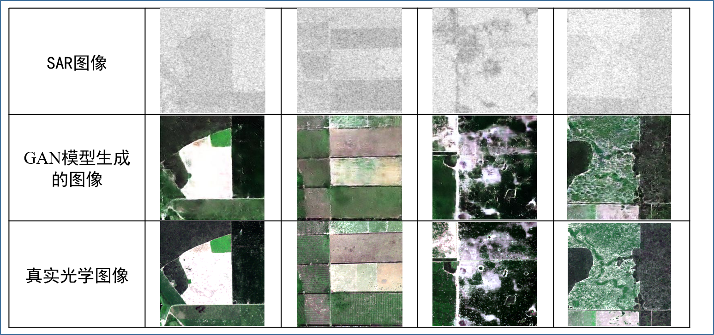

A simple deep learning model(pix2pix) used for translating SAR images to optical images.

Codes referenced from https://github.com/eriklindernoren/Keras-GAN/tree/master/pix2pix.

If you are looking for dataset of SAR and optical image patches, I recommend this https://mediatum.ub.tum.de/1436631.

Here are some samples in my research: images in the first line are SAR images, optical images generated by GAN are in second line, and  real optical images are in third line.

